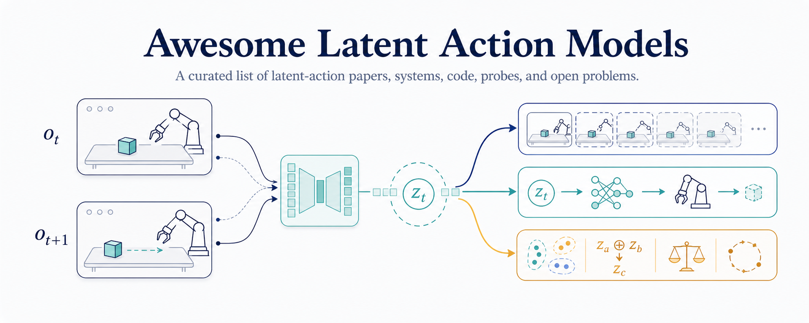
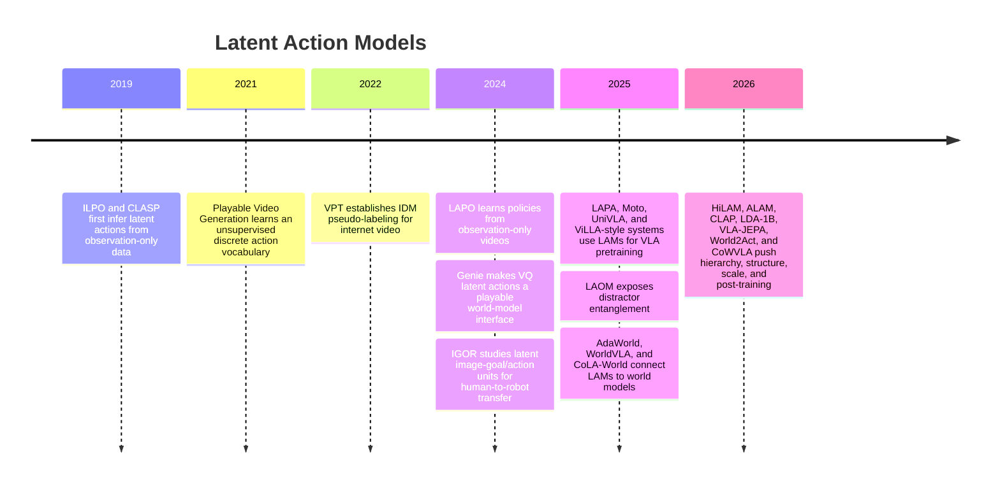

<h1 align="center">Awesome-LAM</h1>

  
  
  
  

  

**A curated list of latent-action papers, systems, code, probes, and open problems.**

Latent Action Models (LAMs) learn a compact representation of "what happened" between observations, usually from action-free or weakly labeled video, and then reuse that representation as a control interface for world models, robot policies, VLAs, or cross-embodiment transfer.

PRs are welcome. Please read [CONTRIBUTING.md](CONTRIBUTING.md) before adding entries.

---

## Overview

This repository provides a curated collection of papers, systems, code, probes, and open problems focused on Latent Action Models (LAMs). Unlike broad VLA, WAM, or robot-learning lists, it is organized around the latent-action mechanism itself: how the action representation is learned, what data it uses, and where the latent interface is reused.

The repository is organized around four reading paths:

- 🤖 **Robot Policy & VLA Pretraining**: latent actions used for policy learning, VLA pretraining, and cross-embodiment transfer.
- 🌍 **World Models & Interactive Generation**: latent actions as control interfaces for generated rollouts and world-action models.
- 🔬 **Analysis, Robustness & Theory**: probes, failure modes, evaluation gaps, and borderline cases.
- 🧱 **Foundations & Precursors**: early observation-only control, playable video, and latent skill spaces.

Found this useful? Star the repository to help others discover it. ⭐

### 📚 Table of Contents

- [🎯 Aim](#aim)
- [🧭 Evolution at a Glance](#evolution-at-a-glance)
- [📝 Papers & Surveys](#papers--surveys)
- [🤖 Robot Policy & VLA Pretraining](#robot-policy--vla-pretraining)
- [🌍 World Models & Interactive Generation](#world-models--interactive-generation)
- [🔬 Analysis, Robustness & Theory](#analysis-robustness--theory)
- [🟨 Borderline: Pseudo-Action Labeling](#borderline-pseudo-action-labeling)
- [🧱 Foundations & Precursors](#foundations--precursors)
- [🧪 Evaluation & Probing](#evaluation--probing)
- [❤️ Contact](#contact)
- [🤝 Contributing](#contributing)
- [⚖️ License](#license)

## Aim

This repository organizes latent-action research by the latent-action technique itself, not by the downstream system label. A paper appears once as a primary entry under the section that best captures its main contribution, with cross-links where it also matters.

The goal is fast navigation for researchers who need to compare representation choices, objectives, data domains, downstream use, code availability, and evaluation protocols without chasing scattered world-model, VLA, and robot-learning reading lists.

## Evolution at a Glance

## Papers & Surveys

- [Core] **ALAM: Algebraically Consistent Latent Action Model for Vision-Language-Action Models** (2026) adds compositional and invertibility probes for latent-action quality.  
  
- [Survey] **Latent World Models for Automated Driving: A Unified Taxonomy, Evaluation Framework, and Open Challenges** (2026) is the closest taxonomy so far (preprint, under review at IEEE T-ITS) that explicitly separates latent worlds, latent actions, and latent generators.  
  
- [Core] **Latent Action Learning Requires Supervision in the Presence of Distractors** (LAOM, 2025) gives the main negative result for unsupervised LAM robustness.  
  
- [Core] **Latent Action Pretraining from Videos** (LAPA, 2025) makes latent action prediction a VLA pretraining objective.  
   
- [Core] **Genie: Generative Interactive Environments** (2024) uses discrete latent actions as the control alphabet of an interactive world model.  
  
- [Core] **Learning to Act without Actions** (LAPO, 2024) introduces the observation-only latent-action policy loop.  
   

## Robot Policy & VLA Pretraining

### Models at a glance

| Name | Year | Representation | Objective | Data | Primary use | Links |
|---|---:|---|---|---|---|---|
| ALAM | 2026 | continuous structured | structured + flow matching | robot | VLA-pretrain, policy-decode | [Paper](https://arxiv.org/abs/2605.10819) |
| LAFP | 2026 | discrete-VQ | IDM+FDM + flow matching | game/sim | policy-decode | [Paper](https://arxiv.org/abs/2606.10517) |
| World2Act | 2026 | continuous skill | contrastive/world-model dynamics | robot | post-train | [Paper](https://arxiv.org/abs/2603.10422), [Project](https://wm2act.github.io/) |
| HiLAM | 2026 | hierarchical | IDM+FDM | mixed | VLA-pretrain, policy-decode | [Paper](https://arxiv.org/abs/2603.05815), [Code](https://github.com/lucidrains/HiLAM) |
| CoWVLA | 2026 | continuous motion | world-model | robot | VLA-pretrain | [Paper](https://arxiv.org/abs/2603.03195), [Code](https://github.com/fx-hit/CoWVLA) |
| Joint-Aligned Latent Action | 2026 | continuous | IDM+FDM + action alignment | human-video | VLA-pretrain | [Paper](https://arxiv.org/abs/2602.21736) |
| LDA-1B | 2026 | continuous | IDM+FDM | mixed | VLA-pretrain | [Paper](https://arxiv.org/abs/2602.12215), [Project](https://pku-epic.github.io/LDA/), [Code](https://github.com/jiangranlv/LDA-1B) |
| VLA-JEPA | 2026 | continuous action tokens | world-model | human-video + robot | VLA-pretrain | [Paper](https://arxiv.org/abs/2602.10098), [Code](https://github.com/ginwind/VLA-JEPA) |
| ConLA | 2026 | continuous | contrastive | human-video + robot | cross-embodiment | [Paper](https://arxiv.org/abs/2602.00557) |
| CLAP | 2026 | continuous | contrastive | human-video | VLA-pretrain | [Paper](https://arxiv.org/abs/2601.04061), [Project](https://lin-shan.com/CLAP/) |
| WholeBodyVLA | 2025 | discrete-token | IDM+FDM | ego + humanoid | VLA-pretrain, policy-decode | [Paper](https://arxiv.org/abs/2512.11047), [Project](https://opendrivelab.com/WholeBodyVLA/), [Code](https://github.com/OpenDriveLab/WholebodyVLA) |
| LatBot | 2025 | factored motion/scene tokens | IDM+FDM + distillation | robot + human hand | VLA-pretrain | [Paper](https://arxiv.org/abs/2511.23034), [Project](https://mm-robot.github.io/distill_latent_action/) |
| LAWM | 2025 | continuous | world-model | human-video + robot | VLA-pretrain | [Paper](https://arxiv.org/abs/2509.18428), [Code](https://github.com/baheytharwat/lawm) |
| villa-X | 2025 | discrete-token | IDM+FDM + proprio grounding | human-video + robot | VLA-pretrain | [Paper](https://arxiv.org/abs/2507.23682), [Project](https://microsoft.github.io/villa-x/), [Code](https://github.com/microsoft/villa-x) |
| AMPLIFY | 2025 | discrete-token | flow | human-video + robot | policy-decode | [Paper](https://arxiv.org/abs/2506.14198), [Code](https://github.com/pairlab/AMPLIFY) |
| CoMo | 2025 | continuous motion | IDM+FDM + contrastive | web-video | VLA-pretrain | [Paper](https://arxiv.org/abs/2505.17006), [Code](https://github.com/MCG-NJU/CoMo) |
| UniSkill | 2025 | continuous skill | IDM+FDM | human-video + robot | cross-embodiment | [Paper](https://arxiv.org/abs/2505.08787), [Project](https://kimhanjung.github.io/UniSkill/), [Code](https://github.com/KimHanjung/UniSkill) |
| UniVLA | 2025 | discrete-VQ | IDM+FDM + language | mixed | VLA-pretrain, cross-embodiment | [Paper](https://arxiv.org/abs/2505.06111), [Code](https://github.com/OpenDriveLab/UniVLA) |
| CLAM | 2025 | continuous | IDM+FDM | robot | policy-decode | [Paper](https://arxiv.org/abs/2505.04999), [Project](https://clamrobot.github.io) |
| GR00T N1 | 2025 | discrete-VQ | IDM+FDM | human-video + robot + synthetic | VLA-pretrain | [Paper](https://arxiv.org/abs/2503.14734), [Code](https://github.com/NVIDIA/Isaac-GR00T) |
| AgiBot World Colosseo / GO-1 | 2025 | discrete-token | IDM+FDM | robot + web video | VLA-pretrain | [Paper](https://arxiv.org/abs/2503.06669), [Code](https://github.com/OpenDriveLab/AgiBot-World) |
| Moto | 2025 | discrete-token | IDM+FDM | robot video | VLA-pretrain, policy-decode | [Paper](https://arxiv.org/abs/2412.04445), [Code](https://github.com/TencentARC/Moto) |
| LAPA | 2025 | discrete-VQ | IDM+FDM | human-video + robot | VLA-pretrain | [Paper](https://arxiv.org/abs/2410.11758), [Code](https://github.com/LatentActionPretraining/LAPA) |

### Entries

- [Core] **ALAM** — *Algebraically Consistent Latent Action Model for Vision-Language-Action Models*. 2026.  
    
  `repr: continuous structured` `obj: structured + flow` `data: robot` `use: VLA-pretrain · policy-decode`  
  Adds additivity and reversibility constraints, then uses those same structures as representation-quality probes.

- **LAFP** — *Preserving Latent Action Structure in Latent Policy Learning via Flow Matching*. 2026.
  
  `repr: discrete-VQ` `obj: IDM+FDM + flow matching` `data: game/sim` `use: policy-decode`
  Replaces behavior-cloning latent-policy distillation with flow matching and uses inference-time interpolation to reduce stochastic latent-action to physical-action decoder misalignment.

- **World2Act** — *Latent Action Post-Training from World Model Dynamics*. 2026.  
     
  `repr: continuous skill` `obj: contrastive + world-model dynamics` `data: robot` `use: post-train`  
  Post-trains VLA actions against latent world-model dynamics instead of fragile pixel-space rollouts.

- **HiLAM** — *Hierarchical Latent Action Model*. ICLR 2026 Workshop on World Models.  
     
  `repr: hierarchical` `obj: IDM+FDM` `data: mixed` `use: VLA-pretrain · policy-decode`  
  Extracts both short-horizon motion tokens and temporally extended skill latents from unlabeled video.

- **CoWVLA** — *Chain of World: World Model Thinking in Latent Motion*. CVPR 2026.  
      
  `repr: continuous motion` `obj: world-model` `data: robot` `use: VLA-pretrain`  
  Uses latent motion as the medium for internal world-model reasoning inside a VLA.

- **Joint-Aligned Latent Action** — *Joint-Aligned Latent Action: Towards Scalable VLA Pretraining in the Wild*. CVPR 2026.  
    
  `repr: continuous` `obj: IDM+FDM + action alignment` `data: human-video` `use: VLA-pretrain`  
  Aligns predictive latent actions from 7.5M in-the-wild hand videos with inverse dynamics and a small amount of real actions for scalable VLA pretraining.

- **LDA-1B** — *Scaling Latent Dynamics Action Model via Universal Embodied Data Ingestion*. RSS 2026.  
      
  `repr: continuous` `obj: IDM+FDM` `data: mixed` `use: VLA-pretrain`  
  Studies scaling latent-dynamics action models with heterogeneous embodied-data ingestion.

- **VLA-JEPA** — *Enhancing Vision-Language-Action Model with Latent World Model*. 2026.  
      
  `repr: continuous action tokens` `obj: world-model` `data: human-video + robot` `use: VLA-pretrain`  
  Trains action tokens to predict world-state transitions, connecting latent actions to JEPA-style latent world states.

- **ConLA** — *Contrastive Latent Action Learning from Human Videos for Robotic Manipulation*. 2026.  
    
  `repr: continuous` `obj: contrastive` `data: human-video + robot` `use: cross-embodiment`  
  Learns latent actions from human videos with contrastive objectives, then maps them to robot manipulation policies with limited action-labeled data.

- **CLAP** — *Contrastive Latent Action Pretraining for Learning Vision-Language-Action Models from Human Videos*. 2026.  
     
  `repr: continuous` `obj: contrastive` `data: human-video` `use: VLA-pretrain`  
  Replaces reconstruction-heavy latent-action learning with contrastive alignment from human video.

- **WholeBodyVLA** — *Towards Unified Latent VLA for Whole-Body Loco-Manipulation Control*. 2025.  
      
  `repr: discrete-token` `obj: IDM+FDM` `data: ego + humanoid` `use: VLA-pretrain · policy-decode`  
  Learns separate locomotion and manipulation latent actions from action-free egocentric videos for humanoid loco-manipulation.

- **LatBot** — *Distilling Universal Latent Actions for Vision-Language-Action Models*. 2025.  
     
  `repr: factored motion/scene tokens` `obj: IDM+FDM + distillation` `data: robot + human hand` `use: VLA-pretrain`  
  Decomposes latent actions into motion and scene tokens to filter irrelevant dynamics before distilling them into VLA models.

- **LAWM** — *Latent Action Pretraining Through World Modeling*. 2025.  
     
  `repr: continuous` `obj: world-model` `data: human-video + robot` `use: VLA-pretrain`  
  Learns latent actions as the conditioning variable of a world model, providing a compute-light alternative to separate quantized IDMs.

- **villa-X** — *Enhancing Latent Action Modeling in Vision-Language-Action Models*. Microsoft Research, 2025.  
      
  `repr: discrete-token` `obj: IDM+FDM + proprio grounding` `data: human-video + robot` `use: VLA-pretrain`  
  Systematically studies how latent actions should be learned, grounded, and injected into the ViLLA-style VLA pipeline.

- **AMPLIFY** — *Actionless Motion Priors for Robot Learning from Videos*. 2025.  
     
  `repr: discrete-token` `obj: flow` `data: human-video + robot` `use: policy-decode`  
  Tokenizes keypoint-trajectory motion from action-free video and decodes latent motion to executable actions with a small inverse-dynamics head, so each part scales independently.

- **CoMo** — *Learning Continuous Latent Motion from Internet Videos for Scalable Robot Learning*. 2025.  
     
  `repr: continuous motion` `obj: IDM+FDM + contrastive` `data: web-video` `use: VLA-pretrain`  
  Learns continuous latent motion from internet video with temporal-difference and contrastive objectives that limit shortcut and background leakage, and proposes direct latent-motion metrics.

- **UniSkill** — *Imitating Human Videos via Cross-Embodiment Skill Representations*. CoRL 2025.  
      
  `repr: continuous skill` `obj: IDM+FDM` `data: human-video + robot` `use: cross-embodiment`  
  Moves from step-level motion latents to skill-level representations transferable from human demonstrations.

- [Core] **UniVLA** — *Learning to Act Anywhere with Task-centric Latent Actions*. RSS 2025.  
     
  `repr: discrete-VQ` `obj: IDM+FDM + language` `data: mixed` `use: VLA-pretrain · cross-embodiment`  
  Disentangles task-centric latent actions from embodiment and camera nuisance through language-conditioned decomposition.

- **CLAM** — *Continuous Latent Action Models for Robot Learning from Unlabeled Demonstrations*. 2025.  
     
  `repr: continuous` `obj: IDM+FDM` `data: robot` `use: policy-decode`  
  Learns continuous latent actions from unlabeled demonstrations with a jointly trained decoder that grounds them to executable actions from little labeled play data.

- [System] **GR00T N1** — *An Open Foundation Model for Generalist Humanoid Robots*. NVIDIA, 2025.  
     
  `repr: discrete-VQ` `obj: IDM+FDM` `data: human-video + robot + synthetic` `use: VLA-pretrain`  
  Trains a VQ-VAE latent action model on action-free human videos and neural trajectories and uses the latent embeddings as pretraining action labels in its data pyramid.

- [System] **AgiBot World Colosseo / GO-1** — *A Large-scale Manipulation Platform for Scalable and Intelligent Embodied Systems*. IROS 2025 Best Paper Award Finalist.  
     
  `repr: discrete-token` `obj: IDM+FDM` `data: robot + web-video` `use: VLA-pretrain`  
  Useful as an industrial-scale system reference; keep latent-action-specific claims tied to the GO-1/ViLLA components rather than the whole dataset platform.

- **Moto** — *Latent Motion Token as the Bridging Language for Learning Robot Manipulation from Videos*. ICCV 2025 Oral.  
      
  `repr: discrete-token` `obj: IDM+FDM` `data: robot` `use: VLA-pretrain · policy-decode`  
  Treats latent motion tokens as an autoregressive bridge between video pretraining and robot action fine-tuning.

- [Core] **LAPA** — *Latent Action Pretraining from Videos*. ICLR 2025.  
     
  `repr: discrete-VQ` `obj: IDM+FDM` `data: human-video + robot` `use: VLA-pretrain`  
  Quantizes visual deltas into latent action tokens, pretrains a VLM to predict them, then fine-tunes on action-labeled robot data.

### Benchmarks and probes

| Benchmark/probe | Capability | Typical data | Used by | Notes |
|---|---|---|---|---|
| LIBERO | language-conditioned manipulation | robot | LAPA, ALAM, VLA-JEPA-style work | Downstream VLA metric, not a direct LAM metric. |
| MetaWorld / MT50 | multi-task manipulation | robot | ALAM | Useful for compositional and transfer claims. |
| SimplerEnv | sim-to-real manipulation policy eval | robot/sim | VLA pretraining papers | Captures policy transfer more than latent quality. |
| Algebraic probes | additivity, reversibility, cumulative reconstruction | robot | ALAM | Closest current direct LAM-quality probe. |

## World Models & Interactive Generation

### Models at a glance

| Name | Year | Representation | Objective | Data | Primary use | Links |
|---|---:|---|---|---|---|---|
| CLAW | 2026 | continuous | adversarial latent regularization | mixed video | WM-control | [Paper](https://arxiv.org/abs/2606.04130) |
| DiLA | 2026 | continuous | IDM+FDM | mixed video | WM-control | [Paper](https://arxiv.org/abs/2605.15725) |
| Being-H0.7 | 2026 | continuous | world-action model | ego | cross-embodiment | [Paper](https://arxiv.org/abs/2605.00078), [Project](https://research.beingbeyond.com/being-h07), [Code](https://github.com/BeingBeyond/Being-H) |
| Latent-WAM | 2026 | continuous | world-action model | driving | WM-control, policy-decode | [Paper](https://arxiv.org/abs/2603.24581) |
| LAC-WM | 2026 | unified latent action | robot foundation world model | robot | cross-embodiment, WM-control | [OpenReview](https://openreview.net/forum?id=vEZgPr1deb) |
| FLAM | 2026 | factored latent actions | world-model | multi-entity video | WM-control, policy-decode | [Paper](https://arxiv.org/abs/2602.16229) |
| DreamZero | 2026 | world-action model | video + action modeling | robot + video | WM-control, policy-decode, cross-embodiment | [Paper](https://arxiv.org/abs/2602.15922), [Code](https://github.com/dreamzero0/dreamzero) |
| Olaf-World | 2026 | continuous | IDM+FDM | web-video | WM-control | [Paper](https://arxiv.org/abs/2602.10104), [Code](https://github.com/showlab/Olaf-World) |
| SWIRL | 2026 | continuous | world-model | mixed | WM-control | [Paper](https://arxiv.org/abs/2602.06130) |
| Latent Action World Models in the Wild | 2026 | continuous | IDM+FDM | web-video | WM-control | [Paper](https://arxiv.org/abs/2601.05230) |
| Motus | 2025/2026 | continuous flow latents | flow + MoT world model | robot + video | WM-control, VLA-pretrain | [Paper](https://arxiv.org/abs/2512.13030), [Project](https://motus-robotics.github.io/motus), [Code](https://github.com/thu-ml/Motus) |
| CoLA-World | 2025/2026 | continuous | joint LAM + world-model | mixed video | WM-control | [Paper](https://arxiv.org/abs/2510.26433) |
| Latent Action WMs with Unlabeled Trajectories | 2025 | continuous | world-model | mixed | WM-control, policy-decode | [Paper](https://arxiv.org/abs/2512.10016) |
| Genie 3 | 2025 | action interface | world-model | mixed | WM-control | [Blog](https://deepmind.google/discover/blog/genie-3-a-new-frontier-for-world-models/) |
| WorldVLA | 2025 | discrete-token | world-model | robot | WM-control, policy-decode | [Paper](https://arxiv.org/abs/2506.21539), [Code](https://github.com/alibaba-damo-academy/WorldVLA) |
| AdaWorld | 2025 | continuous | IDM+FDM | mixed video | WM-control | [Paper](https://arxiv.org/abs/2503.18938), [Code](https://github.com/Little-Podi/AdaWorld) |
| PlaySlot | 2025 | object-centric | IDM+FDM | sim video | WM-control, policy-decode | [Paper](https://arxiv.org/abs/2502.07600), [Code](https://github.com/angelvillar96/PlaySlot) |
| GenieRedux | 2024 | discrete-VQ | IDM+FDM | game/sim | WM-control | [Paper](https://arxiv.org/abs/2409.06445), [Code](https://github.com/insait-institute/GenieRedux) |

### Entries

- **CLAW** — *Learning Continuous Latent Action World Models via Adversarial Latent Regularization*. 2026.  
    
  `repr: continuous` `obj: adversarial latent regularization` `data: mixed video` `use: WM-control`  
  End-to-end self-supervised continuous latent-action world model trained with adversarial latent regularization on unlabeled video.

- **DiLA** — *Disentangled Latent Action World Models*. 2026.  
    
  `repr: continuous` `obj: IDM+FDM + disentanglement` `data: mixed video` `use: WM-control`  
  Disentangles content from structure when inferring abstract latent actions and introduces an action cycle-transfer metric.

- **Being-H0.7** — *Being-H0.7: A Latent World-Action Model from Egocentric Videos*. 2026.  
      
  `repr: continuous` `obj: world-model` `data: ego` `use: cross-embodiment`  
  Uses egocentric human video as the native source for latent world-action modeling.

- **Latent-WAM** — *Latent World Action Modeling for End-to-End Autonomous Driving*. 2026.  
    
  `repr: continuous` `obj: world-model` `data: driving` `use: WM-control · policy-decode`  
  Transfers the latent world-action recipe to autonomous driving.

- **LAC-WM** — *Latent Action Robot Foundation World Models for Cross-Embodiment Adaptation*. 2026.
  
  `repr: unified latent action` `obj: robot foundation world model` `data: robot` `use: cross-embodiment · WM-control`
  Learns a unified latent action space shared across robot embodiments and conditions a robot foundation world model on that space for adaptation to unseen embodiments.

- **FLAM** — *Factored Latent Action World Models*. 2026.  
    
  `repr: factored latent actions` `obj: world-model` `data: mixed video` `use: WM-control · policy-decode`  
  Decomposes scenes into factors, each with its own inferred latent action, to handle multi-entity dynamics.

- [System] **DreamZero** — *World Action Models are Zero-shot Policies*. 2026.
    
  `repr: world-action model` `obj: video + action modeling` `data: robot + video` `use: WM-control · policy-decode · cross-embodiment`
  Builds a real-time closed-loop world action model on a pretrained video diffusion backbone and uses joint video-action modeling for zero-shot policy execution and cross-embodiment transfer.

- **Olaf-World** — *Orienting Latent Actions for Video World Modeling*. 2026.  
     
  `repr: continuous` `obj: IDM+FDM + semantic anchoring` `data: web-video` `use: WM-control`  
  Anchors annotation-free latent actions to semantic effects, enabling zero-shot action transfer for controllable world models.

- **SWIRL** — *Self-Improving World Modelling with Latent Actions*. 2026.  
    
  `repr: continuous` `obj: world-model` `data: mixed` `use: WM-control`  
  Treats actions as latent variables over state-only sequences and alternates forward- and inverse-model updates in a coordinate-ascent loop.

- **Learning Latent Action World Models In The Wild** — Meta FAIR, 2026.  
    
  `repr: continuous` `obj: IDM+FDM` `data: web-video` `use: WM-control`  
  Stress-tests latent-action world modeling beyond games and robots on in-the-wild video.

- **Motus** — *A Unified Latent Action World Model*. 2025/2026.  
      
  `repr: continuous flow latents` `obj: flow + world-model` `data: robot + video` `use: WM-control · VLA-pretrain`  
  Distills optical flow into pixel-level delta actions inside a mixture-of-transformers world-action architecture.

- [Core] **CoLA-World** — *Co-Evolving Latent Action World Models*. 2025/2026.  
    
  `repr: continuous` `obj: IDM+FDM + world-model` `data: mixed video` `use: WM-control`  
  Jointly trains a from-scratch LAM with a pretrained video world model; warm-up alignment is the key stabilizer.

- **Latent Action World Models for Control with Unlabeled Trajectories** — 2025.  
    
  `repr: continuous` `obj: world-model` `data: mixed` `use: WM-control · policy-decode`  
  Learns a shared latent action space jointly from action-free and action-labeled data, then trains a latent-action offline-RL policy on one dynamics model.

- [System] **Genie 3** — *A New Frontier for World Models*. Google DeepMind, 2025.  
    
  `repr: action interface` `obj: world-model` `data: mixed` `use: WM-control`  
  Real-time promptable interactive worlds; include as system context rather than a standalone LAM method paper.

- **WorldVLA** — *Towards Autoregressive Action World Model*. 2025.  
     
  `repr: discrete-token` `obj: world-model` `data: robot` `use: WM-control · policy-decode`  
  Uses one autoregressive backbone where action and world prediction mutually supervise each other.

- **AdaWorld** — *Learning Adaptable World Models with Latent Actions*. ICML 2025.  
      
  `repr: continuous` `obj: IDM+FDM` `data: mixed video` `use: WM-control`  
  Pretrains a world model with latent actions so new control interfaces can be adapted with minimal interaction data.

- **PlaySlot** — *Learning Inverse Latent Dynamics for Controllable Object-Centric Video Prediction and Planning*. ICML 2025.  
     
  `repr: object-centric` `obj: IDM+FDM` `data: sim video` `use: WM-control · policy-decode`  
  Infers object-centric latent actions from unlabeled video to condition controllable prediction and drive planning.

- **GenieRedux** — *Learning Generative Interactive Environments by Trained Agent Exploration*. 2024.  
     
  `repr: discrete-VQ` `obj: IDM+FDM` `data: game/sim` `use: WM-control`  
  Open Genie reproduction (tokenizer + LAM + dynamics) trained on agent-collected video; the CVPR 2025 follow-up ([2504.02515](https://arxiv.org/abs/2504.02515)) adds exploration-driven data collection.

### Benchmarks and probes

| Benchmark/probe | Capability | Primary data | Used by | Notes |
|---|---|---|---|---|
| Interactive rollout controllability | Does the same latent action produce consistent effects? | generated video/world-model rollouts | Genie, CoLA-World, AdaWorld | Directly relevant but often qualitative. |
| Dynamics prediction under latent controls | Does the LAM help next-state prediction? | mixed video | LAWM, CoLA-World, WorldVLA | Confounds LAM quality with model capacity. |
| Driving closed-loop metrics | planning/control in driving scenes | driving | Latent-WAM | Domain-specific downstream metric. |

## Analysis, Robustness & Theory

### Models at a glance

| Name | Year | Focus | Data | Links |
|---|---:|---|---|---|
| Prediction over Reconstruction | 2026 | action-relevance probing | mixed video | [Paper](https://arxiv.org/abs/2606.07687) |
| Why Latent Actions Fail | 2026 | exogenous-information leakage | mixed | [Paper](https://arxiv.org/abs/2605.20223) |
| ALAM probes | 2026 | additivity and reversibility | robot | [Paper](https://arxiv.org/abs/2605.10819) |
| From Pixels to Tokens | 2026 | latent-action supervision study | robot | [Paper](https://arxiv.org/abs/2605.04678) |
| LARY | 2026 | latent-action benchmark | web-video | [Paper](https://arxiv.org/abs/2604.11689) |
| WAM vs VLA robustness | 2026 | robustness evaluation | robot/sim | [Paper](https://arxiv.org/abs/2603.22078) |
| Latent World Models for Automated Driving | 2026 | taxonomy/evaluation | driving | [Paper](https://arxiv.org/abs/2603.09086) |
| LAOF | 2026 | optical-flow robustness constraint | robot | [Paper](https://arxiv.org/abs/2511.16407), [Code](https://github.com/XizoB/LAOF) |
| Object-Centric Latent Action Learning | 2026 | object-centric distractor robustness | game/sim | [Paper](https://arxiv.org/abs/2502.09680) |
| What Do Latent Action Models Actually Learn? | 2025 | theory of LAM objectives | synthetic | [Paper](https://arxiv.org/abs/2506.15691) |
| LAOM | 2025 | distractor entanglement | game/sim | [Paper](https://arxiv.org/abs/2502.00379) |

### Entries

- **What Makes Video World Model Latents Action-Relevant: Prediction over Reconstruction** — 2026.  
    
  `repr: continuous` `obj: analysis` `data: mixed video` `use: analysis`  
  Inverse-dynamics probing shows temporal-predictive pretraining, not reconstruction, drives the action-relevance of world-model latents.

- **Why Latent Actions Fail, and How to Prevent It** — 2026.  
    
  `repr: continuous` `obj: analysis` `data: mixed` `use: analysis`  
  Shows reconstruction-trained LAMs leak exogenous information from future observations and proposes endogenous representation spaces with auxiliary supervision.

- [Core] **ALAM probes** — see [ALAM](#robot-policy--vla-pretraining).  
  `repr: structured` `obj: structured` `data: robot` `use: analysis`  
  Additivity, reversibility, and long-horizon cumulative reconstruction are useful beyond the ALAM model itself.

- **From Pixels to Tokens: A Systematic Study of Latent Action Supervision for Vision-Language-Action Models** — 2026.  
    
  `repr: discrete-token` `obj: analysis` `data: robot` `use: analysis`  
  Systematically compares image-based and action-based latent-action supervision for VLAs; discrete latent-action token supervision wins.

- **LARY** — *A Latent Action Representation Yielding Benchmark for Generalizable Vision-to-Action Alignment*. 2026.  
    
  `repr: continuous` `obj: analysis` `data: web-video` `use: analysis`  
  1M-video, 151-category benchmark evaluating latent action representations for both semantics and low-level control.

- **Do World Action Models Generalize Better than VLAs? A Robustness Study** — 2026.  
    
  `repr: mixed` `obj: analysis` `data: robot/sim` `use: analysis`  
  Robustness evaluation of video-pretrained world-action models against VLAs on LIBERO-Plus and RoboTwin 2.0-Plus.

- [Survey] **Latent World Models for Automated Driving: A Unified Taxonomy, Evaluation Framework, and Open Challenges**. 2026.  
    
  Organizes latent worlds, latent actions, and latent generators, and is useful for positioning driving-oriented LAM work.

- **LAOF** — *Robust Latent Action Learning with Optical Flow Constraints*. CVPR 2026.  
     
  `repr: continuous` `obj: flow` `data: robot` `use: VLA-pretrain`  
  Uses optical-flow constraints to suppress distractor entanglement without relying on action labels.

- **Object-Centric Latent Action Learning** — AAAI 2026 oral.  
    
  `repr: continuous` `obj: IDM+FDM + object-centric` `data: game/sim` `use: analysis`  
  Separates agent motion from background dynamics with object-centric pretraining, cutting distractor entanglement in LAPO-style latents roughly in half.

- **What Do Latent Action Models Actually Learn?** — NeurIPS 2025.  
    
  `repr: continuous` `obj: IDM+FDM analysis` `data: synthetic` `use: analysis`  
  Linear-model theory of when LAM latents capture action-driven change versus nuisance variation, motivating augmentation and auxiliary action prediction.

- [Core] **LAOM** — *Latent Action Learning Requires Supervision in the Presence of Distractors*. ICML 2025.  
    
  `repr: continuous` `obj: IDM+FDM analysis` `data: game/sim` `use: analysis`  
  Shows that unsupervised latent actions can entangle nuisance dynamics under visual distractors; small action supervision can help.

## Borderline: Pseudo-Action Labeling

These entries use pseudo-labels from an IDM trained with ground-truth actions, or use an explicit track/flow representation rather than a latent. They are still important because they established the practical "label video with inferred actions" playbook that label-free LAMs later generalized.

### Models at a glance

| Name | Year | Representation | Objective | Data | Primary use | Links |
|---|---:|---|---|---|---|---|
| DreamGen | 2025 | pseudo-labeled robot actions | supervised-IDM on generated video | robot/synthetic | policy-pretrain | [Paper](https://arxiv.org/abs/2505.12705), [Project](https://research.nvidia.com/labs/gear/dreamgen/) |
| Im2Flow2Act | 2024 | object flow | flow generation | human video + sim | cross-embodiment | [Paper](https://arxiv.org/abs/2407.15208), [Code](https://github.com/real-stanford/im2Flow2Act) |
| OmniJARVIS | 2024 | discrete-FSQ behavior tokens | self-supervised tokenization (action-labeled) | game/sim | VLA-pretrain | [Paper](https://arxiv.org/abs/2407.00114), [Project](https://omnijarvis.github.io/) |
| Track2Act | 2024 | point tracks | track prediction | web video | policy-decode | [Paper](https://arxiv.org/abs/2405.01527), [Project](https://homangab.github.io/track2act/) |
| ATM | 2024 | point tracks | track prediction | robot + human video | policy-pretrain | [Paper](https://arxiv.org/abs/2401.00025), [Code](https://github.com/Large-Trajectory-Model/ATM) |
| VPT | 2022 | pseudo-labeled ground-truth actions | supervised-IDM | Minecraft video | policy-pretrain | [Paper](https://arxiv.org/abs/2206.11795), [Code](https://github.com/openai/Video-Pre-Training) |

### Entries

- [Borderline] **DreamGen** — *Unlocking Generalization in Robot Learning through Video World Models*. NVIDIA, 2025.  
     
  `repr: pseudo-labeled actions` `obj: supervised-IDM` `data: robot + synthetic` `use: policy-pretrain`  
  Uses generated videos and inverse dynamics labeling for robot policy training; include as a pseudo-action precedent, not a label-free LAM.

- [Borderline] **Im2Flow2Act** — *Flow as the Cross-domain Manipulation Interface*. CoRL 2024.  
     
  `repr: object flow` `obj: flow` `data: human-video + sim` `use: cross-embodiment`  
  Uses generated object flow as an explicit cross-embodiment action interface for a flow-conditioned policy.

- [Borderline] **OmniJARVIS** — *Unified Vision-Language-Action Tokenization Enables Open-World Instruction Following Agents*. NeurIPS 2024.  
     
  `repr: discrete-FSQ` `obj: self-supervised tokenization` `data: game/sim` `use: VLA-pretrain`  
  Adds FSQ behavior tokens to the LM vocabulary as the action interface; the tokenizer trains on trajectories that include actions.

- [Borderline] **Track2Act** — *Predicting Point Tracks from Internet Videos enables Generalizable Robot Manipulation*. ECCV 2024.  
     
  `repr: point tracks` `obj: track prediction` `data: web-video` `use: policy-decode`  
  Decodes goal-conditioned point tracks predicted from web video into end-effector plans plus a learned residual policy.

- [Borderline] **ATM** — *Any-point Trajectory Modeling for Policy Learning*. RSS 2024.  
     
  `repr: point tracks` `obj: track prediction` `data: robot + human-video` `use: policy-pretrain`  
  Predicts future trajectories of arbitrary points from action-free video and uses tracks as policy guidance with minimal action labels — anchor of the track-as-pseudo-action playbook.

- [Borderline] **VPT** — *Video PreTraining: Learning to Act by Watching Unlabeled Online Videos*. NeurIPS 2022.  
     
  `repr: pseudo-labeled actions` `obj: supervised-IDM` `data: game/sim` `use: policy-pretrain`  
  Historical precursor: train an IDM on labeled Minecraft data, pseudo-label internet video, then train a policy.

## Foundations & Precursors

### Models at a glance

| Name | Year | Representation | Objective | Data | Primary use | Links |
|---|---:|---|---|---|---|---|
| Genie 2 | 2024 | continuous/action interface | world-model | game/sim | WM-control | [Blog](https://deepmind.google/discover/blog/genie-2-a-large-scale-foundation-world-model/) |
| IGOR | 2024 | continuous | IDM+FDM | human-video + robot | cross-embodiment | [Paper](https://arxiv.org/abs/2411.00785) |
| DynaMo | 2024 | continuous | IDM+FDM | robot | representation pretraining | [Paper](https://arxiv.org/abs/2409.12192), [Code](https://github.com/jeffacce/dynamo_ssl) |
| Genie | 2024 | discrete-VQ | IDM+FDM | game video | WM-control | [Paper](https://arxiv.org/abs/2402.15391) |
| LAPO | 2024 | continuous -> discrete | IDM+FDM | game/sim | policy-decode | [Paper](https://arxiv.org/abs/2312.10812), [Code](https://github.com/schmidtdominik/LAPO) |
| XSkill | 2023 | skill prototypes | contrastive | human-video + robot | cross-embodiment | [Paper](https://arxiv.org/abs/2307.09955), [Code](https://github.com/real-stanford/xskill) |
| MimicPlay | 2023 | continuous plan | structured | human play video + robot | policy-decode | [Paper](https://arxiv.org/abs/2302.12422), [Code](https://github.com/j96w/MimicPlay) |
| FICC | 2023 | discrete-VQ | IDM+FDM | game video | WM-control, policy-decode | [Paper](https://openreview.net/forum?id=Sy-o2N0hF4f), [Code](https://github.com/YeWR/FICC) |
| Playable Environments | 2022 | discrete | IDM+FDM | video | WM-control | [Paper](https://arxiv.org/abs/2203.01914), [Code](https://github.com/willi-menapace/PlayableEnvironments) |
| Playable Video Generation | 2021 | discrete | IDM+FDM | video | WM-control | [Paper](https://arxiv.org/abs/2101.12195), [Code](https://github.com/willi-menapace/PlayableVideoGeneration) |
| Play-LMP | 2019 | continuous plan | structured | robot play | policy-decode | [Paper](https://arxiv.org/abs/1903.01973), [Project](https://learning-from-play.github.io) |
| ILPO | 2019 | discrete | IDM+FDM | game/sim | policy-decode | [Paper](https://arxiv.org/abs/1805.07914), [Code](https://github.com/ashedwards/ILPO) |
| CLASP | 2019 | continuous | world-model | sim video | policy-decode | [Paper](https://arxiv.org/abs/1806.09655) |

### Entries

- [System] **Genie 2** — *A Large-Scale Foundation World Model*. Google DeepMind, 2024.
  
  `repr: continuous/action interface` `obj: world-model` `data: game/sim` `use: WM-control`
  Scales the interactive-world-model line to richer 3D environments and longer horizons.

- **IGOR** — *Image-GOal Representations are the Atomic Control Units for Foundation Models in Embodied AI*. 2024.
  
  `repr: continuous` `obj: IDM+FDM` `data: human-video + robot` `use: cross-embodiment`
  Studies image-goal/action units as transferable control primitives across human and robot demonstrations.

- [Borderline] **DynaMo** — *In-Domain Dynamics Pretraining for Visuo-Motor Control*. NeurIPS 2024.
   
  `repr: continuous` `obj: IDM+FDM` `data: robot` `use: policy-pretrain`
  Jointly trains latent inverse and forward dynamics on action-free demonstrations; the latent action is a representation-learning bottleneck rather than an action interface.

- [Core] **Genie** — *Genie: Generative Interactive Environments*. ICML 2024 Best Paper.
  
  `repr: discrete-VQ` `obj: IDM+FDM` `data: game/sim` `use: WM-control`
  Establishes VQ latent actions as the control interface for a playable generative environment.

- [Core] **LAPO** — *Learning to Act without Actions*. ICLR 2024 spotlight.
   
  `repr: continuous -> discrete` `obj: IDM+FDM` `data: game/sim` `use: policy-decode`
  Minimal recipe: infer latent actions from observation-only data, then ground them with a small labeled set.

- **XSkill** — *Cross Embodiment Skill Discovery*. CoRL 2023.
   
  `repr: skill prototypes` `obj: contrastive` `data: human-video + robot` `use: cross-embodiment`
  Discovers skill prototypes from unlabeled human and robot video and composes them for cross-embodiment imitation.

- [Borderline] **MimicPlay** — *Long-Horizon Imitation Learning by Watching Human Play*. CoRL 2023 oral.
   
  `repr: continuous plan` `obj: structured` `data: human-video + robot` `use: policy-decode`
  Learns a latent plan space from action-free human play video to guide a low-level policy trained with few teleoperated demonstrations.

- **FICC** — *Become a Proficient Player with Limited Data through Watching Pure Videos*. ICLR 2023.
   
  `repr: discrete-VQ` `obj: IDM+FDM` `data: game/sim` `use: WM-control · policy-decode`
  Extracts VQ latent actions from action-free video with forward-inverse cycle consistency, then fine-tunes the pretrained latent dynamics for Atari control.

- **Playable Environments** — *Playable Environments: Video Manipulation in Space and Time*. CVPR 2022.
   
  `repr: discrete` `obj: IDM+FDM` `data: video` `use: WM-control`
  Extends Playable Video Generation to controlling 3D object dynamics in a volumetric playable environment.

- **Playable Video Generation** — CVPR 2021.
   
  `repr: discrete` `obj: IDM+FDM` `data: video` `use: WM-control`
  Learns a discrete action vocabulary fully unsupervised from unlabeled video and uses it as the user's control interface — the direct precursor of Genie's playable interface.

- [Borderline] **Play-LMP** — *Learning Latent Plans from Play*. CoRL 2019.
   
  `repr: continuous plan` `obj: structured` `data: robot play` `use: policy-decode`
  Uses teleoperated play data with actions, but established the latent plan/skill space as a reusable control interface.

- **ILPO** — *Imitating Latent Policies from Observation*. ICML 2019.
   
  `repr: discrete` `obj: IDM+FDM` `data: game/sim` `use: policy-decode`
  Canonical precursor: infers discrete latent actions and their effects from state-only observations, then grounds them with limited environment interaction.

- **CLASP** — *Learning What You Can Do Before Doing Anything*. ICLR 2019.
  
  `repr: continuous` `obj: world-model` `data: sim video` `use: policy-decode`
  Learns a latent action space from passive video via stochastic prediction with a composability constraint, then grounds it with orders of magnitude fewer action labels.

### Benchmarks and probes

| Probe | What it measures | Used by | Notes |
|---|---|---|---|
| Action grounding after observation-only pretraining | Whether latent actions can be decoded into executable controls | LAPO | Needs a small labeled set. |
| Controllability of generated rollouts | Whether latent actions produce consistent world changes | Genie line | Indirectly depends on world-model quality. |

## Evaluation & Probing

There is still no widely adopted LAM benchmark — LARY (2026) is a first dedicated attempt. Current work mostly evaluates downstream task success or uses method-specific probes.

| Evaluation target | Example metric | Example papers | Limitation |
|---|---|---|---|
| Action recoverability | decode latent to executable action | LAPO, VPT-style precursors | Requires labeled action data. |
| Controllability | same latent causes consistent visual/dynamic effect | Genie, AdaWorld, CoLA-World | Hard to separate LAM from world model. |
| Robustness to distractors | performance under nuisance visual dynamics | LAOM, LAOF | Narrow synthetic stress tests so far. |
| Algebraic structure | additivity, reversibility, cumulative reconstruction | ALAM | Promising but not yet standardized. |
| Dedicated latent-action benchmark | semantics + low-level control alignment over 1M videos | LARY | New; adoption still unproven. |
| Downstream VLA success | LIBERO, SimplerEnv, MetaWorld, real robot | LAPA, UniVLA, ALAM, VLA-JEPA | Confounds LAM quality with policy architecture and data scale. |

## ❤️ Contact

I am Shen Yujiao. Suggestions, corrections, and new latent-action resources are welcome.

Email: [shenyujiao18@gmail.com](mailto:shenyujiao18@gmail.com)

## Contributing

Contributions should update [`README.md`](README.md) as the single source of truth. Keep one primary entry per paper or system, use official links when possible, and include all four tags for model entries.

See [CONTRIBUTING.md](CONTRIBUTING.md) for the checklist and PR format.

## License

[CC0 1.0 Universal](https://creativecommons.org/publicdomain/zero/1.0/). See [LICENSE](LICENSE).
