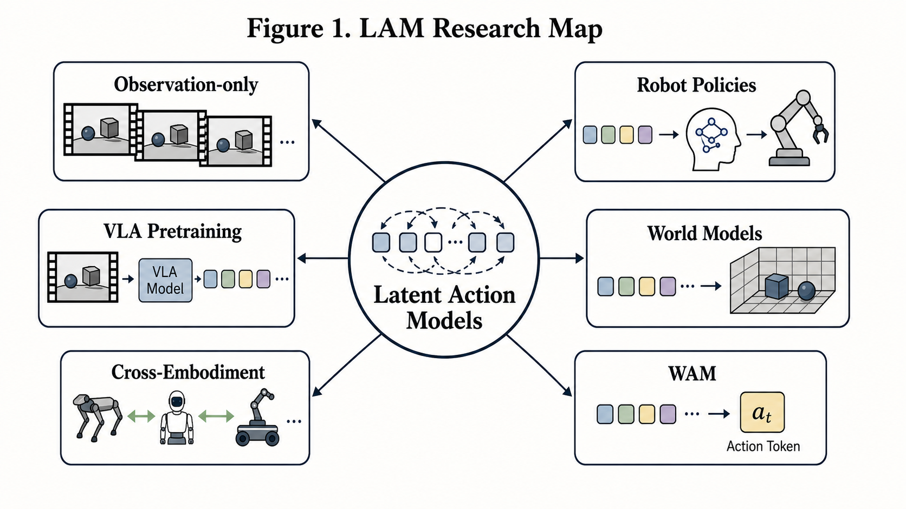
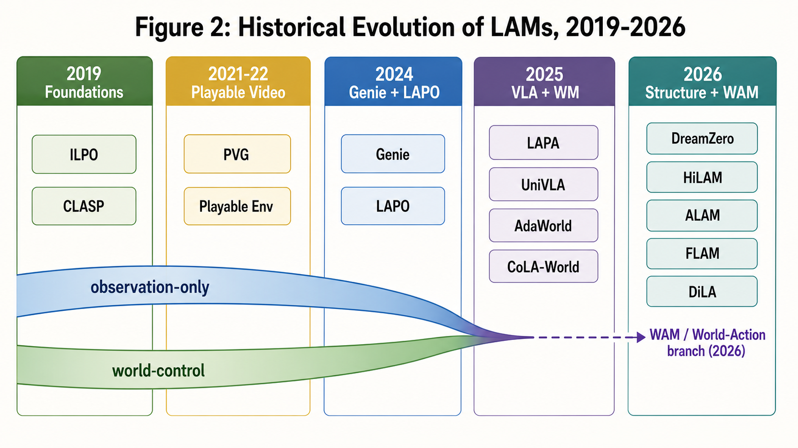
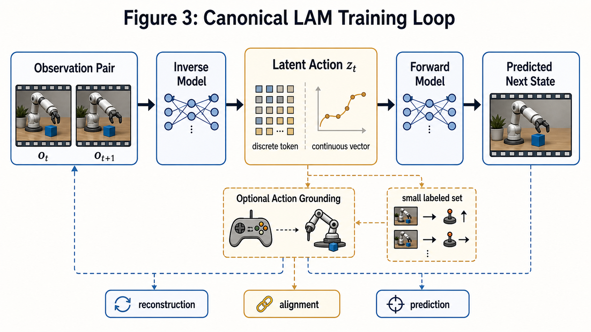
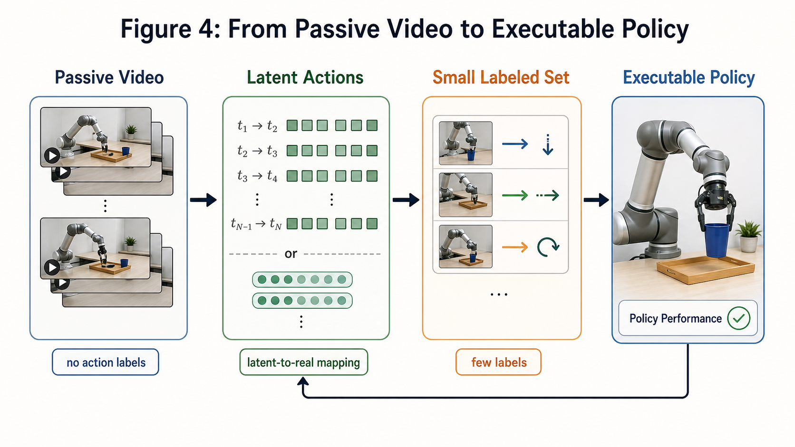
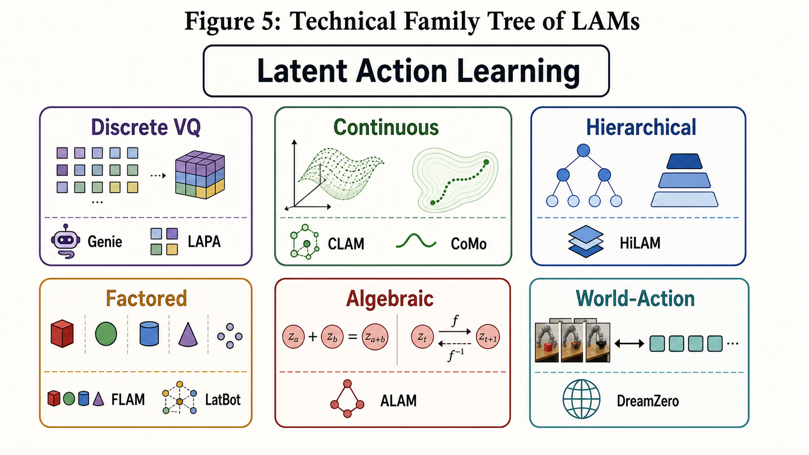
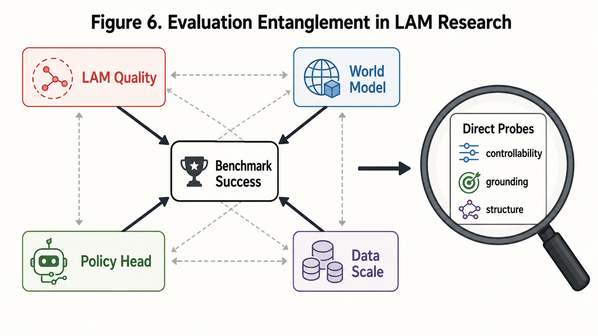
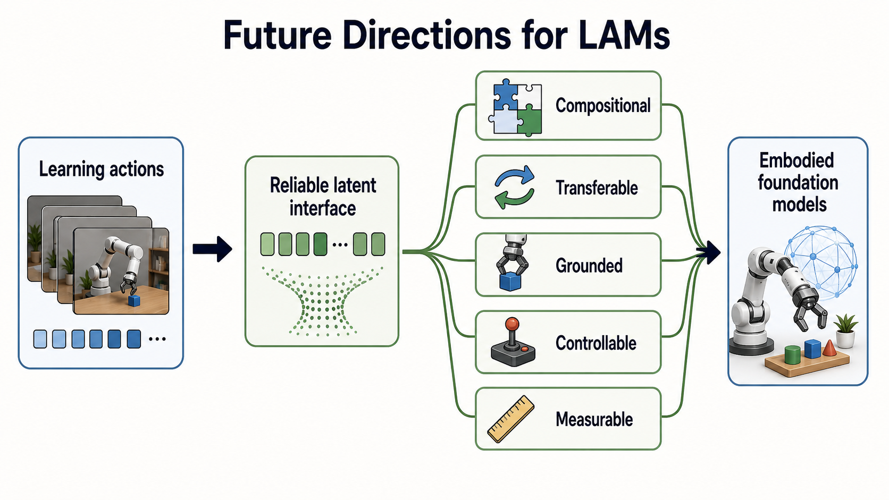

# Latent Action Models: 技术路线、进化轨迹与研究版图

版本：2026-06-18  
范围：基于本仓库当前 README 的 LAM 文献清单与公开论文链接整理  
图像：本文所有 Figure 均由生图模型生成，图注和正文负责给出精确论文名、年份和解释

## 摘要

Latent Action Model (LAM) 研究的核心问题不是“如何直接预测机器人关节动作”，而是：能否从相邻状态、视频片段或无动作标注轨迹中学习一个紧凑的、可复用的“变化原因”表示，并把它作为后续世界模型、策略学习、VLA 预训练或跨 embodiment 迁移的控制接口。这个接口通常被记为 latent action、action token、motion latent、skill latent 或 world-action latent。

从历史上看，LAM 不是从 World Action Model (WAM) 单线衍生出来的。更准确的谱系是：2019 年前后的 observation-only imitation 和 latent policy 学习提出了“从状态转移中反推出动作”的基本问题；2021-2024 年 playable video 与 Genie 把离散 latent action 做成可交互世界模型的控制字母表；2024-2025 年 LAPO、LAPA、UniVLA、CLAM 等工作把这种表示转向机器人策略和 VLA 预训练；2025-2026 年 AdaWorld、CoLA-World、DreamZero、FLAM、DiLA 等工作又把 LAM 与 world model、video diffusion、world-action joint modeling 更紧密地耦合起来。

因此，LAM 的演化不是“WAM -> LAM”，而是多个方向在 latent-action interface 上汇合：无动作模仿、可玩视频、世界模型、机器人策略、VLA 预训练、跨 embodiment 迁移、鲁棒性与可评测性。

**Figure 1. LAM Research Map.** LAM 位于中心，连接 observation-only learning、VLA pretraining、robot policies、world models、WAM 与 cross-embodiment transfer。图中 WAM 是一个晚近应用分支，而不是 LAM 的父类。

## 1. 概念边界：LAM 到底是什么

### 1.1 工作定义

本文采用的工作定义是：

> LAM 学习一个表示 `z_t`，使它能够解释或控制从 `o_t` 到 `o_{t+1}` 的变化，并在没有动作标签或只有少量动作标签的情况下复用为控制、预测或预训练信号。

这里的 `o_t` 可以是低维状态、图像、视频帧、视觉语言上下文或世界模型 latent state；`z_t` 可以是离散 token、连续向量、层级 skill、object-centric factor、代数结构化变量，或与视频生成模型联合建模的 world-action token。

LAM 研究中最容易混淆的概念有四类：

| 概念 | 核心对象 | 是否必须有真实动作标签 | 典型用途 | 与 LAM 的关系 |
|---|---|---:|---|---|
| Latent action | 状态变化的隐式动作表示 | 否，常为无动作或弱标注 | 控制接口、预训练标签、策略 latent | LAM 的核心对象 |
| Pseudo action | 由监督 IDM 反推的动作伪标签 | 通常需要一部分真实动作训练 IDM | 扩大动作标注数据 | 是重要前驱，但不一定是 label-free LAM |
| Skill / plan latent | 跨较长时域的计划或技能变量 | 可有可无 | 长时程策略、模仿学习 | 与 LAM 重叠，但时间尺度更长 |
| WAM / world-action model | 世界状态与动作的联合生成或预测模型 | 可有可无 | world-model control、zero-shot policy | 是 LAM 与 world model 汇合后的分支 |

关键区别在于，LAM 关注的是“动作表示如何被学出来、是否真的捕捉了可控变化”；WAM 关注的是“世界状态与动作如何被联合建模并用于闭环策略”。一个 WAM 可以包含 latent action，但不是所有 LAM 都是 WAM。

## 2. 历史路线图：2019-2026

LAM 的路线可以分成五个阶段。

**Figure 2. Historical Evolution of LAMs.** 时间线从 observation-only imitation 和 playable video 出发，经过 Genie/LAPO 的 2024 年节点，在 2025 年分化到 VLA 与 world-model 两条强应用线，并在 2026 年进入结构化、层级化、factored、WAM 化和评测化阶段。

### 2.1 2019：observation-only imitation 的 latent action 原型

2019 年的 ILPO 和 CLASP 是 LAM 视角下最重要的早期原型。

ILPO 的基本想法是：即使没有动作标签，也可以从状态转移中聚类或推断出一组离散 latent actions，再用少量环境交互把这些 latent actions ground 到真实动作。它把“动作”从外部标注变成了一个由动态一致性约束反推出的变量。

CLASP 则更强调“先学会自己能做什么”：从 passive video 中学习 latent action space，再用很少的真实动作或交互完成 grounding。它已经具备后续 LAM 的三个核心元素：被动观察、latent control variable、少量 grounding。

这个阶段的代表性特征是：

- 数据多为 game/sim 或低维状态，视觉复杂度有限。
- 目标是 policy learning 或 imitation learning，而不是大规模 world model。
- latent action 的价值主要体现在“降低动作标注需求”。

### 2.2 2021-2022：Playable Video 把 latent action 变成可交互接口

Playable Video Generation 和 Playable Environments 把 latent action 的直觉推进到视频生成：从无标签视频中学习一个离散动作词表，用户选择不同 latent action，就能控制视频中实体的运动。这条线对后来的 Genie 很关键，因为它把 latent action 明确做成了“playable generative environment”的控制界面。

这个阶段的贡献不只是模型结构，而是问题设定的变化：latent action 不再只是为了最终接到真实环境动作，也可以作为生成世界中的交互控制字母表。

### 2.3 2024：Genie 与 LAPO 的双节点

2024 年是 LAM 进入更广泛研究视野的关键节点。

Genie 把 action-free video 中学到的离散 VQ latent actions 用作 generative interactive environment 的控制接口。它的影响在于证明：即便没有真实动作标签，也可以从大量视频中学出能驱动可交互世界模型的 action tokens。Genie 之后，LAM 与 foundation world model 的关系显著加强。

LAPO 则保留了更经典的 observation-only policy loop：先从 observation-only videos 推断 latent actions，再用少量 action-labeled data 把 latent actions 映射到可执行动作。它更直接连接机器人/控制问题，也让“no action labels -> latent action -> few-shot grounding -> policy”这条路线变得清晰。

### 2.4 2025：VLA 预训练与 world-model 控制同时扩张

2025 年是 LAM 应用爆发的一年，主要分成两条线。

第一条是 VLA / robot policy pretraining。LAPA 把 latent action prediction 做成 VLM/VLA 预训练目标：从视频中量化视觉变化为 latent action tokens，再训练模型预测这些 tokens，最后在动作标注机器人数据上 fine-tune。UniVLA、CLAM、Moto、GR00T N1、villa-X 等工作沿着不同数据源、表示形式和 grounding 策略扩展这条线。

第二条是 world-model control。AdaWorld、WorldVLA、CoLA-World 等工作把 latent actions 放到世界模型中作为控制变量，让模型在 latent control 下预测未来状态或生成可控 rollouts。这里的关键转变是，LAM 不再只为策略提供预训练标签，也直接成为 world model 的条件变量。

2025 年同时出现了更明确的负面结果与分析工作。LAOM 指出，在存在视觉 distractors 时，纯无监督 latent action 容易 entangle nuisance dynamics；这使得后续研究开始强调 flow/object-centric constraints、少量监督、对比学习、代数结构、direct probes。

### 2.5 2026：结构化、WAM 化、评测化

2026 年的 LAM 研究呈现三种趋势。

第一是结构化。HiLAM 引入层级 latent actions，把短时 motion token 与长时 skill latent 结合；FLAM 关注 factored latent actions，用不同 factor 处理多实体动态；ALAM 则强调加法、可逆性和累计重建等代数一致性，把表示结构和评测 probe 绑定起来。

第二是 WAM 化。DreamZero 等 WAM 工作把 video/action joint modeling 与 zero-shot policy 结合，强调在世界模型或视频扩散模型中直接建模 action-conditioned dynamics。这不是 LAM 的起点，而是 LAM 与 world model 汇合后的强系统形态。

第三是评测化。LARY、ALAM probes、LAOM/LAOF/Object-Centric LAM 等工作都在回应同一个问题：下游 policy success 不等于 latent action quality。一个 LAM 看起来有效，可能只是因为 world model 更大、policy head 更强、数据更多，而不一定说明 `z_t` 真正学到了可控动作。

## 3. 标准 LAM 训练闭环

多数 LAM 可以抽象成 inverse-forward bottleneck：

1. 输入相邻状态或视频片段 `o_t, o_{t+1}`。
2. inverse model 或 encoder 推断 latent action `z_t`。
3. forward model 用 `o_t` 和 `z_t` 预测 `o_{t+1}` 或其 latent state。
4. 通过 reconstruction、prediction、contrastive alignment、cycle consistency、flow/object constraints 等信号训练。
5. 如果需要执行真实动作，再用少量 action-labeled data 学 `z_t -> a_t` 的 grounding。

**Figure 3. Canonical LAM Training Loop.** 典型 LAM 把 latent action 放在状态转移的瓶颈位置。关键是 `z_t` 不是 ground-truth action label，而是从转移中推断出的可复用控制变量。

这个闭环解释了 LAM 的优势和风险。优势是可以吃下大量 action-free videos；风险是如果 reconstruction 目标过强，模型可能把 future observation 中的背景、光照、摄像机运动、无关对象也塞进 `z_t`，导致 latent action 捕捉的是“所有变化”，而不是“agent-controllable change”。

## 4. 从 passive video 到 executable policy

LAM 的机器人价值来自一个经济性假设：视频远多于动作标注数据。理想流程是：

- 用大规模 human/robot/web video 学 latent action space。
- 用小规模 action-labeled robot data 学 latent-to-real-action mapping。
- 在 VLA 或 policy decoder 中复用 latent action 作为中间 supervision 或控制接口。

**Figure 4. From Passive Video to Executable Policy.** LAM 的 practical promise 是把大规模 passive video 转换为可利用的动作先验，再用少量真实动作完成 grounding。

这一路线中有三个关键瓶颈：

| 瓶颈 | 问题 | 典型缓解策略 |
|---|---|---|
| 表示可控性 | `z_t` 是否对应 agent 可控变化 | forward-inverse cycle、contrastive objective、object/flow constraints |
| 真实动作 grounding | latent action 能否稳定映射到 robot action | 少量 labeled set、action alignment、policy decoder |
| 跨 embodiment | 人手、机器人臂、移动底盘的变化单位不同 | task-centric factorization、language conditioning、skill-level latent |

## 5. 技术家族树

LAM 的表示形式正在从“单一离散 token”扩展成多个家族。

**Figure 5. Technical Family Tree of LAMs.** 这些分支不是互斥分类，而是常常组合出现：一个系统可以同时是 continuous、hierarchical、world-model-conditioned，也可以在 discrete tokens 上加入 algebraic probes。

| 技术家族 | 代表工作 | 核心直觉 | 优势 | 风险 |
|---|---|---|---|---|
| Discrete VQ | Genie, LAPA, Moto, UniVLA | 把状态变化量化成 action tokens | 易接入 LLM/VLA token pipeline，便于分类预测 | token 粒度可能过粗，连续控制需解码 |
| Continuous | CLAM, CoMo, LAWM | 用连续向量表示 motion/action | 更适合机器人连续动作和细粒度运动 | 可解释性弱，容易吸收 nuisance variation |
| Hierarchical | HiLAM, skill-latent lines | 区分短时动作和长时技能 | 支持长时程规划和 temporal abstraction | 层级边界难学，评测复杂 |
| Factored / object-centric | FLAM, LatBot, Object-Centric LAM | 把多对象/多因素动态拆开 | 降低背景和多实体干扰 | factor 分解需要额外 inductive bias |
| Algebraic / structured | ALAM | 强调加法、可逆、组合一致性 | 提供 direct probes，利于解释和组合 | 结构假设可能限制复杂行为 |
| World-Action | DreamZero, Latent-WAM | 联合建模世界状态和动作 | 适合闭环 world-model control | 容易把 LAM quality 与 world-model capacity 混在一起 |

## 6. 代表论文矩阵

| 年份 | 论文/系统 | 路线位置 | latent action 形式 | 主要贡献 |
|---:|---|---|---|---|
| 2019 | ILPO | observation-only imitation | discrete | 从 state-only observations 推断 latent actions，并用少量交互 grounding |
| 2019 | CLASP | passive video -> control | continuous | 从被动视频学习可组合 latent action space |
| 2021 | Playable Video Generation | playable video | discrete | 从无标签视频学习可控制视频的动作词表 |
| 2024 | Genie | interactive world model | discrete VQ | 把 VQ latent actions 作为生成世界模型的控制接口 |
| 2024 | LAPO | policy grounding | continuous -> discrete | observation-only videos 到 policy 的最小闭环 |
| 2025 | LAPA | VLA pretraining | discrete VQ | 用 latent action prediction 作为 VLA 预训练目标 |
| 2025 | UniVLA | VLA/cross-embodiment | discrete VQ | task-centric latent actions，弱化 embodiment 和 camera nuisance |
| 2025 | CLAM | robot learning | continuous | 从 unlabeled demonstrations 学连续 latent actions 并解码到策略 |
| 2025 | AdaWorld | world model | continuous | 用 latent actions 预训练 adaptable world models |
| 2025/2026 | CoLA-World | joint LAM + world model | continuous | 从头训练 LAM 并与 pretrained video world model 协同 |
| 2026 | DreamZero | WAM | world-action | 把 world action model 用作 zero-shot policy |
| 2026 | HiLAM | hierarchy | hierarchical | 学短时 motion 与长时 skill latent |
| 2026 | ALAM | structured/probing | continuous structured | 用加法、可逆性等代数一致性约束和 probe LAM |
| 2026 | FLAM | factorization | factored | 多实体动态中的 factored latent action |
| 2026 | DiLA | disentanglement | continuous | disentangled latent action world model 与 cycle-transfer metric |
| 2026 | LARY | benchmark | evaluation | 面向 latent action representations 的专门 benchmark |

## 7. 与 VLA、World Model、WAM 的关系

### 7.1 LAM 与 VLA

VLA 需要把视觉、语言和动作放进一个统一建模空间。LAM 的价值在于提供 action-free video 上可训练的中间 supervision。LAPA 类路线把 latent action tokens 当作 VLA 预训练目标；UniVLA 类路线把 latent actions 做成 task-centric 表示；ALAM 类路线进一步问这些 latent actions 是否可组合、可逆、可累计。

因此，在 VLA 中，LAM 更像“动作语义 tokenizer”或“运动变化 supervision”，不是最终 policy 本身。

### 7.2 LAM 与 World Model

World model 需要预测未来状态，但如果没有动作变量，未来预测容易变成 passive video continuation。LAM 给 world model 提供可控条件变量：同一初始状态下，不同 latent action 应该导向不同未来。这就是 Genie、AdaWorld、CoLA-World、LAWM 等工作的共同动机。

但这也带来评估混淆：world model 生成得好，不一定说明 latent action 好；可能只是模型容量大、数据强、decoder 会补细节。

### 7.3 LAM 与 WAM

WAM 可以看作 LAM 与 world model 的更强耦合版本：不仅学世界状态，也显式把 action 或 latent action 纳入联合建模，并希望模型在闭环中直接产生可执行行为。DreamZero 的“world action model as zero-shot policy”代表了这一系统方向。

所以 WAM 是 LAM 的下游系统形态之一，而不是 LAM 的历史来源。

## 8. 评价困境

LAM 领域目前最大的问题之一是缺少被广泛接受的 direct benchmark。很多论文用下游机器人 success rate、LIBERO/SimplerEnv/MetaWorld、world-model rollout quality 或视觉重建误差证明有效，但这些指标都可能被其他因素混淆。

**Figure 6. Evaluation Entanglement in LAM Research.** 下游 benchmark success 同时受 LAM quality、world model、policy head、data scale 影响，因此不能直接等同于 latent-action quality。

| 评价目标 | 代表指标 | 代表工作 | 局限 |
|---|---|---|---|
| Action recoverability | latent-to-real-action decoding accuracy | LAPO, VPT-style precursors | 需要动作标签，且只测可解码性 |
| Rollout controllability | 同一 latent action 是否产生一致效果 | Genie, AdaWorld, CoLA-World | 混入 world-model quality |
| Robustness to distractors | 背景/无关对象变化下表示是否稳定 | LAOM, LAOF, Object-Centric LAM | 测试域常较窄 |
| Algebraic structure | additivity, reversibility, cumulative reconstruction | ALAM | 结构假设强，尚未标准化 |
| Dedicated benchmark | semantic + low-level control alignment | LARY | 新 benchmark，社区采用度待观察 |
| Downstream policy success | LIBERO, SimplerEnv, MetaWorld, real robot | LAPA, UniVLA, ALAM, VLA-JEPA | 强烈受 policy 架构和数据规模影响 |

我认为 LAM 评测未来需要三层分离：

1. **表示层**：`z_t` 是否只编码 controllable/endogenous change。
2. **接口层**：`z_t` 是否能稳定驱动 world model 或 policy decoder。
3. **任务层**：最终 robot/VLA 是否完成任务。

只有把这三层分开，才能判断一篇工作是在改进 LAM，还是在改进 world model、policy head 或数据规模。

## 9. 进化逻辑：为什么路线会这样走

### 9.1 从 action labels 稀缺到 video abundance

机器人动作标注昂贵，互联网视频便宜。LAM 的第一推动力是数据经济性：如果能从 action-free video 中学习“动作等价物”，就能把视频规模转化为控制先验。

### 9.2 从预测未来到控制未来

普通 video prediction 只要求预测可能的未来；LAM 要求找到能区分不同未来的控制变量。Genie 之后，latent action 不再只是辅助表示，而成为可交互生成世界的控制字母表。

### 9.3 从离散 token 到结构化变量

离散 token 方便接入 VLA/LLM pipeline，但机器人控制往往连续、层级、多对象。于是 continuous、hierarchical、factored、algebraic 等路线出现，试图弥补离散 token 的表达限制。

### 9.4 从下游成功到 direct probing

2025-2026 年的分析工作说明：LAM 很容易学到 distractor、future leakage 或非动作因素。因此领域开始从“能提升 policy 吗”转向“latent action 本身学到了什么”。

## 10. 未来研究方向

**Figure 7. Future Directions for LAMs.** 未来 LAM 研究会从“能不能从视频中学出动作”转向“这个 latent interface 是否可组合、可迁移、可 grounding、可控制、可测量”。

| 方向 | 关键问题 | 可能切入点 |
|---|---|---|
| Compositional latent actions | latent actions 能否组合成长动作 | algebraic constraints、skill hierarchy、program-like action tokens |
| Transferable latent actions | 能否跨 robot/human/camera/domain 迁移 | task-centric factorization、language-conditioned abstraction |
| Grounded latent actions | latent 能否稳定映射到真实动作 | few-shot grounding、inverse policy head、hybrid latent-real action training |
| Controllable world models | latent 是否真的控制未来，而非只是重建未来 | interventional rollouts、counterfactual controls、closed-loop evaluation |
| Measurable LAM quality | 如何直接测 latent action 而非测整套系统 | LARY-style benchmark、ALAM probes、distractor stress tests |
| Scalable data curation | 哪些视频真的有可学习动作 | ego/human/robot data filtering、motion saliency、object interaction mining |

## 11. 推荐阅读路径

如果目标是快速理解 LAM 的来龙去脉，建议按以下路线阅读。

| 读者目标 | 阅读顺序 | 目的 |
|---|---|---|
| 入门 LAM 概念 | ILPO -> CLASP -> LAPO -> Genie -> LAPA | 理解 observation-only、playable control、VLA pretraining 三个基本形态 |
| 做 VLA / robot policy | LAPA -> UniVLA -> CLAM -> ALAM -> VLA-JEPA | 看 latent action 如何变成 VLA supervision 和 policy interface |
| 做 world model / WAM | Genie -> AdaWorld -> CoLA-World -> DreamZero -> FLAM/DiLA | 看 latent action 如何控制生成世界和 world-action joint modeling |
| 做鲁棒性与评测 | LAOM -> What Do LAMs Actually Learn -> ALAM -> LARY -> LAOF | 看为什么下游成功不足以证明 latent action 好 |
| 做跨 embodiment | CLASP -> XSkill -> UniSkill -> UniVLA -> LAC-WM/Being-H0.7 | 看 latent action/skill 如何跨人、机器人、视角和平台迁移 |

## 12. 结论

LAM 的主线不是某个单一模型家族，而是一种研究问题：从无动作或弱动作数据中学习可复用的动作变化表示。这个问题最早来自 observation-only imitation 和 passive video control，随后被 Genie 式 interactive world model 放大，又被 LAPA/UniVLA 式 VLA pretraining 工程化，最后在 DreamZero/FLAM/DiLA/ALAM/HiLAM 等工作中走向 world-action modeling、结构化表示和直接评测。

如果用一句话概括进化轨迹：

> LAM 正在从“把视频变化压成一个 token”进化为“为 embodied foundation models 提供可组合、可迁移、可 grounding、可控制、可评测的动作接口”。

这个判断也解释了为什么 LAM 与 WAM 关系紧密但不等价：WAM 是 world-model 系统层面的强应用形态，而 LAM 是更基础的 latent-action representation/interface 问题。

## 参考链接

- ILPO: Imitating Latent Policies from Observation. https://arxiv.org/abs/1805.07914
- CLASP: Learning What You Can Do Before Doing Anything. https://arxiv.org/abs/1806.09655
- Playable Video Generation. https://arxiv.org/abs/2101.12195
- Playable Environments. https://arxiv.org/abs/2203.01914
- LAPO: Learning to Act without Actions. https://arxiv.org/abs/2312.10812
- Genie: Generative Interactive Environments. https://arxiv.org/abs/2402.15391
- LAPA: Latent Action Pretraining from Videos. https://arxiv.org/abs/2410.11758
- LAOM: Latent Action Learning Requires Supervision in the Presence of Distractors. https://arxiv.org/abs/2502.00379
- UniVLA: Learning to Act Anywhere with Task-centric Latent Actions. https://arxiv.org/abs/2505.06111
- CLAM: Continuous Latent Action Models for Robot Learning from Unlabeled Demonstrations. https://arxiv.org/abs/2505.04999
- AdaWorld: Learning Adaptable World Models with Latent Actions. https://arxiv.org/abs/2503.18938
- CoLA-World: Co-Evolving Latent Action World Models. https://arxiv.org/abs/2510.26433
- DreamZero: World Action Models are Zero-shot Policies. https://arxiv.org/abs/2602.15922
- HiLAM: Hierarchical Latent Action Model. https://arxiv.org/abs/2603.05815
- ALAM: Algebraically Consistent Latent Action Model for Vision-Language-Action Models. https://arxiv.org/abs/2605.10819
- FLAM: Factored Latent Action World Models. https://arxiv.org/abs/2602.16229
- DiLA: Disentangled Latent Action World Models. https://arxiv.org/abs/2605.15725
- LARY: A Latent Action Representation Yielding Benchmark for Generalizable Vision-to-Action Alignment. https://arxiv.org/abs/2604.11689
- Why Latent Actions Fail, and How to Prevent It. https://arxiv.org/abs/2605.20223
- Awesome-LAM README. ../../README.md
